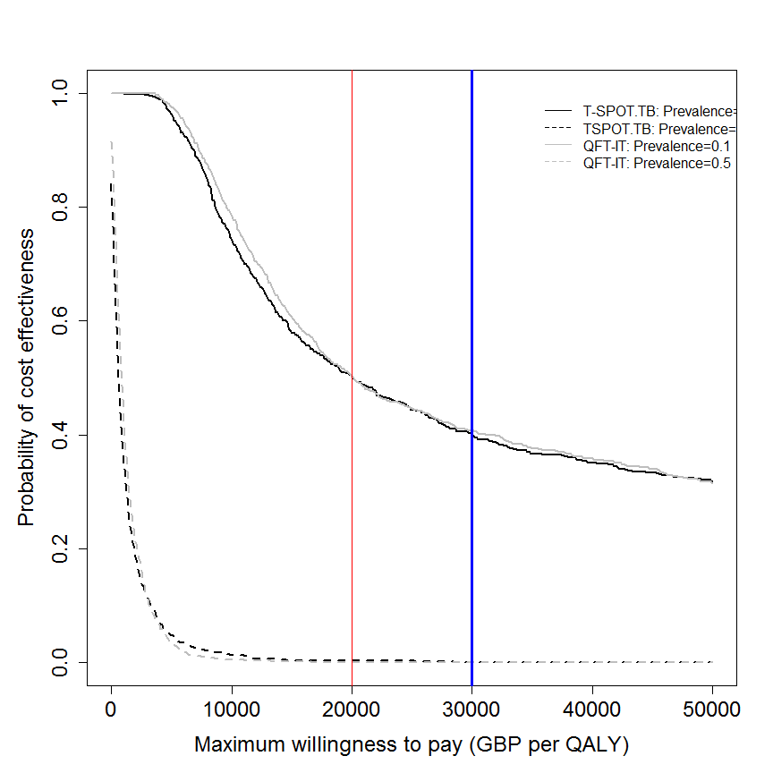

# IDEA study: TST and QFN cost-effectiveness comparison: HIV patients only and indeterminates NOT included
Nathan Green  
29 January 2016  

<!-- README.md is generated from README.Rmd. Please edit that file -->


```r
# http://stackoverflow.com/questions/20060518/in-rstudio-rmarkdown-how-to-setwd
opts_chunk$set(root.dir = '/tmp')
```


```r
# source("../../../analysis scripts/IDEA/alt-YAML_Binomial_dectrees/indiv-dectree-sampling.R")
```


```r
library(IDEAdectree)
library(BCEA)
library(ggplot2)

# load("C:/Users/ngreen1/Dropbox/TB/IDEA/R/packages/IDEAdectree/data/TBdata_clinical_cleaned.RData")
load("../data/TBdata_clinical_cleaned.RData")
load("../data/COSTdistns_allerror.RData")
load("../data/senspec_env.RData")
load("../data/drug_dose-cost.RData")

## sensitivities and specificities from IDEA lab data
attach(senspec.env)

dat <- list()

yearindays <- 365
WTP <- c(20000, 30000)/yearindays

IDEAdectree.simple.TSPOT <- function(...){IDEAdectree.simple(SPEC = TSPOT.HIV.noIndet.spec.mean, SENS = TSPOT.HIV.noIndet.sens.mean, 
                                                             SPECvar = TSPOT.HIV.noIndet.spec.var, SENSvar = TSPOT.HIV.noIndet.sens.var,
                                                             ...)}
IDEAdectree.simple.QFN <- function(...){IDEAdectree.simple(SPEC = QFN.HIV.noIndet.spec.mean, SENS = QFN.HIV.noIndet.sens.mean, 
                                                           SPECvar = QFN.HIV.noIndet.spec.var, SENSvar = QFN.HIV.noIndet.sens.var,
                                                           ...)}

data <- data[data$HIVpos==TRUE,] #n=151
```

#### Prevalence 0.1 and 0.5


```r
## prevalence

dat1 <- IDEAdectree.simple.TSPOT(data=data, name.ruleout = "TSPOT", prev = 0.1)
```

```
## Loading required package: triangle
```

```
## Loading required package: assertive
```

```r
dat2 <- IDEAdectree.simple.TSPOT(data=data, name.ruleout = "TSPOT", prev = 0.5)
dat3 <- IDEAdectree.simple.QFN(data=data, name.ruleout = "QFN", prev = 0.1)
dat4 <- IDEAdectree.simple.QFN(data=data, name.ruleout = "QFN", prev = 0.5)
dat$e <- cbind(dat1$e, dat2$e[,2], dat3$e[,2], dat4$e[,2])
dat$c <- cbind(dat1$c, dat2$c[,2], dat3$c[,2], dat4$c[,2])

intlabels <- c("Current",
               "Enhanced TSPOT: Prevalence=0.1", "Enhanced TSPOT: Prevalence=0.5",
               "Enhanced QFN: Prevalence=0.1", "Enhanced QFN: Prevalence=0.5")

intlabels2 <- c("T-SPOT.TB: Prevalence=0.1", "TSPOT.TB: Prevalence=0.5",
               "QFT-IT: Prevalence=0.1", "QFT-IT: Prevalence=0.5")

# m <- bcea(e=dat$e, c=-dat$c, ref=1, interventions = intlabels)
# contour2(m, wtp=WTP, graph = "ggplot2", ICER.size=2, pos=c(0.1,0.9))+#, xlim=c(-5,5), ylim=c(-200,200)) +
#   ggtitle("") #+ geom_abline(intercept = 0, slope = WTP)


# my.plot.bcea(dat1, dat2, dat3, wtp=WTP, intlabels = intlabels, wtpNEG = "Y")
my.plot.bcea(dat1, dat2, dat3, dat4, wtp=WTP*yearindays, intlabels = intlabels2, wtpNEG = "Y", SCALEcosts=FALSE, SCALEdays=FALSE, labelLong=FALSE, N=769)
```

```
## Loading required package: MASS
```

```
## Loading required package: car
```

```
## Warning in if (is.na(dat4)) {: the condition has length > 1 and only the
## first element will be used
```


```
## [[1]]
## NULL
## 
## [[2]]
## NULL
```

```r
# my.plot.bcea(dat1, dat2, dat3, wtp=WTP, intlabels = intlabels, contour=TRUE, wtpNEG = "Y")
my.plot.bcea(dat1, dat2, dat3, dat4, wtp=WTP*yearindays, intlabels = intlabels2, contour=TRUE, wtpNEG = "Y", SCALEcosts=FALSE, SCALEdays=FALSE, labelLong=FALSE, N=769)
```

```
## Warning in if (is.na(dat4)) {: the condition has length > 1 and only the
## first element will be used
```


```
## [[1]]
## NULL
## 
## [[2]]
## NULL
```

```r
# my.plot.bcea(dat1, dat2, dat3, wtp=WTP, intlabels = intlabels, contour=TRUE, LEVELS=0.5, wtpNEG = "Y")
my.plot.bcea(dat1, dat2, dat3, dat4, wtp=WTP*yearindays, intlabels = intlabels2, contour=TRUE, LEVELS=0.5, wtpNEG = "Y", SCALEcosts=FALSE, SCALEdays=FALSE, labelLong=FALSE, N=769)
```

```
## Warning in if (is.na(dat4)) {: the condition has length > 1 and only the
## first element will be used
```


```
## [[1]]
## NULL
## 
## [[2]]
## NULL
```

```r
# my.plot.ceac(dat1, dat2, dat3, intlabels = c("All","HIV positive","HIV negative"), labelLong=FALSE, TITLE="(a)")
my.plot.ceac(dat1, dat2, dat3, dat4, intlabels = intlabels2, labelLong=FALSE, SCALEcosts=FALSE, SCALEdays=FALSE, N=769)
```

```
## Warning in if (is.na(dat4)) {: the condition has length > 1 and only the
## first element will be used
```



```
## [[1]]
## NULL
## 
## [[2]]
## NULL
```

```r
my.plot.ceac(dat1, dat2, dat3, dat4, intlabels = intlabels2, labelLong=FALSE, SCALEcosts=FALSE, SCALEdays=FALSE, N=769, CI=TRUE)
```

```
## Warning in if (is.na(dat4)) {: the condition has length > 1 and only the
## first element will be used
```


```
## [[1]]
## NULL
## 
## [[2]]
## NULL
```

```r
# par(mfrow=c(2,2))
# my.plot.bcea(dat1, dat2, dat3, dat4, WTP, intlabels, YLIM=c(-200,200))
# my.plot.bcea(dat1, dat2, dat3, dat4, WTP, intlabels, contour=TRUE, YLIM=c(-200,200))
# my.plot.bcea(dat1, dat2, dat3, dat4, WTP, intlabels, contour=TRUE, LEVELS=0.5, YLIM=c(-200,200))
# my.plot.ceac(dat1, dat2, dat3, dat4, intlabels)

## in years (not days)
# m <- bcea(e=dat$e/365, c=-dat$c, ref=1, interventions = intlabels)
# contour2(m, wtp=20000, graph = "ggplot2", ICER.size=2, pos=c(0.1,0.9))
# ceac.plot(m)
```


```r
sink(file="../../../output_data/IDEA-BCEA-logfile.txt", append = TRUE)
summary(m)
sink()
```

#### Rule-out test cost 1 and 200 GBP


```r
## rule-out test cost

dat1 <- IDEAdectree.simple.TSPOT(data=data, c.ruleout = 1)
dat2 <- IDEAdectree.simple.TSPOT(data=data, c.ruleout = 200)
dat3 <- IDEAdectree.simple.QFN(data=data, c.ruleout = 1)
dat4 <- IDEAdectree.simple.QFN(data=data, c.ruleout = 200)
dat$e <- cbind(dat1$e, dat2$e[,2], dat3$e[,2], dat4$e[,2])
dat$c <- cbind(dat1$c, dat2$c[,2], dat3$c[,2], dat4$c[,2])

intlabels <- c("Current",
               "Enhanced TSPOT: Rule-out test=£1", "Enhanced TSPOT: Rule-out test=£200",
               "Enhanced QFN: Rule-out test=£1", "Enhanced QFN: Rule-out test=£200")

intlabels2 <- c("T-SPOT.TB: Rule-out test=£1", "T-SPOT.TB: Rule-out test=£200",
               "QFT-IT: Rule-out test=£1", "QFT-IT: Rule-out test=£200")

# my.plot.bcea(dat1, dat2, dat3, wtp=WTP, intlabels = intlabels, wtpNEG = "Y")
my.plot.bcea(dat1, dat2, dat3, dat4, wtp=WTP*yearindays, intlabels = intlabels2, wtpNEG = "Y", SCALEcosts=FALSE, SCALEdays=FALSE, labelLong=FALSE,  N=769)
```

```
## Warning in if (is.na(dat4)) {: the condition has length > 1 and only the
## first element will be used
```


```
## [[1]]
## NULL
## 
## [[2]]
## NULL
```

```r
# my.plot.bcea(dat1, dat2, dat3, wtp=WTP, intlabels = intlabels, contour=TRUE, wtpNEG = "Y")
my.plot.bcea(dat1, dat2, dat3, dat4, wtp=WTP*yearindays, intlabels = intlabels2, contour=TRUE, wtpNEG = "Y", SCALEcosts=FALSE, SCALEdays=FALSE, labelLong=FALSE, N=769)
```

```
## Warning in if (is.na(dat4)) {: the condition has length > 1 and only the
## first element will be used
```


```
## [[1]]
## NULL
## 
## [[2]]
## NULL
```

```r
# my.plot.bcea(dat1, dat2, dat3, wtp=WTP, intlabels = intlabels, contour=TRUE, LEVELS=0.5, wtpNEG = "Y")
my.plot.bcea(dat1, dat2, dat3, dat4, wtp=WTP*yearindays, intlabels = intlabels2, contour=TRUE, LEVELS=0.5, wtpNEG = "Y", SCALEcosts=FALSE, SCALEdays=FALSE, labelLong=FALSE, N=769)
```

```
## Warning in if (is.na(dat4)) {: the condition has length > 1 and only the
## first element will be used
```


```
## [[1]]
## NULL
## 
## [[2]]
## NULL
```

```r
# my.plot.ceac(dat1, dat2, dat3, intlabels = c("All","HIV positive","HIV negative"), labelLong=FALSE, TITLE="(a)")
my.plot.ceac(dat1, dat2, dat3, dat4, intlabels = intlabels2, labelLong=FALSE, SCALEcosts=FALSE, SCALEdays=FALSE, N=769)
```

```
## Warning in if (is.na(dat4)) {: the condition has length > 1 and only the
## first element will be used
```


```
## [[1]]
## NULL
## 
## [[2]]
## NULL
```

```r
my.plot.ceac(dat1, dat2, dat3, dat4, intlabels = intlabels2, labelLong=FALSE, SCALEcosts=FALSE, SCALEdays=FALSE, N=769, CI=TRUE)
```

```
## Warning in if (is.na(dat4)) {: the condition has length > 1 and only the
## first element will be used
```


```
## [[1]]
## NULL
## 
## [[2]]
## NULL
```

```r
# par(mfrow=c(2,2))
# my.plot.bcea(dat1, dat2, dat3, dat4, WTP, intlabels, YLIM=c(-200,200))
# my.plot.bcea(dat1, dat2, dat3, dat4, WTP, intlabels, contour=TRUE, YLIM=c(-200,200))
# my.plot.bcea(dat1, dat2, dat3, dat4, WTP, intlabels, contour=TRUE, LEVELS=0.5, YLIM=c(-200,200))
# my.plot.ceac(dat1, dat2, dat3, dat4, intlabels)

## in years (not days)
# m <- bcea(e=dat$e/365, c=-dat$c, ref=1, interventions = intlabels)
# contour2(m, wtp=20000, graph = "ggplot2", ICER.size=2, pos=c(0.1,0.9))
# ceac.plot(m)
```


```r
sink(file="../../../output_data/IDEA-BCEA-logfile.txt", append = TRUE)
summary(m)
sink()
```

#### Follow-up visit 54 and 127 days


```r
## False negative follow-up time

dat1 <- IDEAdectree.simple.TSPOT(data=data, name.ruleout = "TSPOT", FNtime = 54, FNdist=FALSE)
dat2 <- IDEAdectree.simple.TSPOT(data=data, name.ruleout = "TSPOT", FNtime = 127, FNdist=FALSE)
dat3 <- IDEAdectree.simple.QFN(data=data, name.ruleout = "QFN", FNtime = 54, FNdist=FALSE)
dat4 <- IDEAdectree.simple.QFN(data=data, name.ruleout = "QFN", FNtime = 127, FNdist=FALSE)
dat$e <- cbind(dat1$e, dat2$e[,2], dat3$e[,2], dat4$e[,2])
dat$c <- cbind(dat1$c, dat2$c[,2], dat3$c[,2], dat4$c[,2])

intlabels <- c("Current","Enhanced TSPOT: Follow-up=7 days","Enhanced TSPOT: Follow-up=100 days",
               "Enhanced QFN: Follow-up=7 days","Enhanced QFN: Follow-up=100 days")

intlabels2 <- c("T-SPOT.TB: Follow-up=54 days","T-SPOT.TB: Follow-up=127 days",
               "QFT-IT: Follow-up=54 days","QFT-IT: Follow-up=127 days")

# my.plot.bcea(dat1, dat2, dat3, wtp=WTP, intlabels = intlabels, wtpNEG = "Y")
my.plot.bcea(dat1, dat2, dat3, dat4, wtp=WTP*yearindays, intlabels = intlabels2, wtpNEG = "Y", SCALEcosts=FALSE, SCALEdays=FALSE, labelLong=FALSE,  N=769)
```

```
## Warning in if (is.na(dat4)) {: the condition has length > 1 and only the
## first element will be used
```


```
## [[1]]
## NULL
## 
## [[2]]
## NULL
```

```r
# my.plot.bcea(dat1, dat2, dat3, wtp=WTP, intlabels = intlabels, contour=TRUE, wtpNEG = "Y")
my.plot.bcea(dat1, dat2, dat3, dat4, wtp=WTP*yearindays, intlabels = intlabels2, contour=TRUE, wtpNEG = "Y", SCALEcosts=FALSE, SCALEdays=FALSE, labelLong=FALSE, N=769)
```

```
## Warning in if (is.na(dat4)) {: the condition has length > 1 and only the
## first element will be used
```


```
## [[1]]
## NULL
## 
## [[2]]
## NULL
```

```r
# my.plot.bcea(dat1, dat2, dat3, wtp=WTP, intlabels = intlabels, contour=TRUE, LEVELS=0.5, wtpNEG = "Y")
my.plot.bcea(dat1, dat2, dat3, dat4, wtp=WTP*yearindays, intlabels = intlabels2, contour=TRUE, LEVELS=0.5, wtpNEG = "Y", SCALEcosts=FALSE, SCALEdays=FALSE, labelLong=FALSE, N=769)
```

```
## Warning in if (is.na(dat4)) {: the condition has length > 1 and only the
## first element will be used
```


```
## [[1]]
## NULL
## 
## [[2]]
## NULL
```

```r
# my.plot.ceac(dat1, dat2, dat3, intlabels = c("All","HIV positive","HIV negative"), labelLong=FALSE, TITLE="(a)")
my.plot.ceac(dat1, dat2, dat3, dat4, intlabels = intlabels2, labelLong=FALSE, SCALEcosts=FALSE, SCALEdays=FALSE, N=769)
```

```
## Warning in if (is.na(dat4)) {: the condition has length > 1 and only the
## first element will be used
```


```
## [[1]]
## NULL
## 
## [[2]]
## NULL
```

```r
my.plot.ceac(dat1, dat2, dat3, dat4, intlabels = intlabels2, labelLong=FALSE, SCALEcosts=FALSE, SCALEdays=FALSE, N=769, CI=TRUE)
```

```
## Warning in if (is.na(dat4)) {: the condition has length > 1 and only the
## first element will be used
```


```
## [[1]]
## NULL
## 
## [[2]]
## NULL
```

```r
# par(mfrow=c(2,2))
# my.plot.bcea(dat1, dat2, dat3, dat4, WTP, intlabels, YLIM=c(-200,200))
# my.plot.bcea(dat1, dat2, dat3, dat4, WTP, intlabels, contour=TRUE, YLIM=c(-200,200))
# my.plot.bcea(dat1, dat2, dat3, dat4, WTP, intlabels, contour=TRUE, LEVELS=0.5, YLIM=c(-200,200))
# my.plot.ceac(dat1, dat2, dat3, dat4, intlabels)

## in years (not days)
# m <- bcea(e=dat$e/365, c=-dat$c, ref=1, interventions = intlabels)
# contour2(m, wtp=20000, graph = "ggplot2", ICER.size=2, pos=c(0.1,0.9))
# ceac.plot(m, pos=c(0,0))
```


```r
sink(file="../../../output_data/IDEA-BCEA-logfile.txt", append = TRUE)
summary(m)
sink()
```


```r
## clinical judgement cut-off values

dat1 <- IDEAdectree.simple.TSPOT(data=data, name.ruleout = "TSPOT", cutoff = 0.7)
dat2 <- IDEAdectree.simple.TSPOT(data=data, name.ruleout = "TSPOT", cutoff = 0.3)
dat3 <- IDEAdectree.simple.QFN(data=data, name.ruleout = "QFN", cutoff = 0.7)
dat4 <- IDEAdectree.simple.QFN(data=data, name.ruleout = "QFN", cutoff = 0.3)
dat$e <- cbind(dat1$e, dat2$e[,2], dat3$e[,2], dat4$e[,2])
dat$c <- cbind(dat1$c, dat2$c[,2], dat3$c[,2], dat4$c[,2])

intlabels <- c("Current","Enhanced TSPOT: Threshold=0.7","Enhanced TSPOT: Threshold=0.3",
               "Enhanced QFN: Threshold=0.7","Enhanced QFN: Threshold=0.3")

# my.plot.bcea(dat1, dat2, dat3, wtp=WTP, intlabels = intlabels, wtpNEG = "Y")
my.plot.bcea(dat1, dat2, dat3, wtp=WTP*yearindays, intlabels = c("All","HIV positive","HIV negative"), wtpNEG = "Y", SCALEcosts=FALSE, SCALEdays=FALSE, labelLong=FALSE, TITLE="(a)", N=769)

# my.plot.bcea(dat1, dat2, dat3, wtp=WTP, intlabels = intlabels, contour=TRUE, wtpNEG = "Y")
my.plot.bcea(dat1, dat2, dat3, wtp=WTP*yearindays, intlabels = c("All","HIV positive","HIV negative"), contour=TRUE, wtpNEG = "Y", SCALEcosts=FALSE, SCALEdays=FALSE, labelLong=FALSE, TITLE="(a)", N=769)

# my.plot.bcea(dat1, dat2, dat3, wtp=WTP, intlabels = intlabels, contour=TRUE, LEVELS=0.5, wtpNEG = "Y")
my.plot.bcea(dat1, dat2, dat3, wtp=WTP*yearindays, intlabels = c("All","HIV positive","HIV negative"), contour=TRUE, LEVELS=0.5, wtpNEG = "Y", SCALEcosts=FALSE, SCALEdays=FALSE, labelLong=FALSE, TITLE="(a)", N=769)

# my.plot.ceac(dat1, dat2, dat3, intlabels = c("All","HIV positive","HIV negative"), labelLong=FALSE, TITLE="(a)")
my.plot.ceac(dat1, dat2, dat3, intlabels = c("All","HIV positive","HIV negative"), labelLong=FALSE, TITLE="(a)", SCALEcosts=FALSE, SCALEdays=FALSE, N=769)
my.plot.ceac(dat1, dat2, dat3, intlabels = c("All","HIV positive","HIV negative"), labelLong=FALSE, TITLE="(a)", SCALEcosts=FALSE, SCALEdays=FALSE, N=769, CI=TRUE)

# par(mfrow=c(2,2))
# my.plot.bcea(dat1, dat2, dat3, dat4, WTP, intlabels, YLIM=c(-200,200))
# my.plot.bcea(dat1, dat2, dat3, dat4, WTP, intlabels, contour=TRUE, YLIM=c(-200,200))
# my.plot.bcea(dat1, dat2, dat3, dat4, WTP, intlabels, contour=TRUE, LEVELS=0.5, YLIM=c(-200,200))
# my.plot.ceac(dat1, dat2, dat3, dat4, intlabels)

## in years (not days)
# m <- bcea(e=dat$e/365, c=-dat$c, ref=1, interventions = intlabels)
# contour2(m, wtp=20000, graph = "ggplot2", ICER.size=2, pos=c(0.1,0.9))
# ceac.plot(m, pos=c(0,0))
```


```r
sink(file="../../../output_data/IDEA-BCEA-logfile.txt", append = TRUE)
summary(m)
sink()
```


```r
## Ethnic group
# 
# dat1 <- IDEAdectree.simple.1cutoff(data=data[data$Ethnclass=="Indian Sub-continent",])
# dat2 <- IDEAdectree.simple.1cutoff(data=data[data$Ethnclass=="Black",])
# dat2 <- IDEAdectree.simple.1cutoff(data=data[data$Ethnclass=="White",])
# dat$e <- cbind(dat1$e, dat2$e[,2], dat3$e[,2])
# dat$c <- cbind(dat1$c, dat2$c[,2], dat3$c[,2])
# 
# intlabels <- c("Current","Enhanced: Indian Sub-continent","Enhanced: Black","Enhanced: White")
# m <- bcea(e=dat$e, c=-dat$c, ref=1, interventions = intlabels)
# contour2(m, wtp=WTP, graph = "ggplot2", ICER.size=2, pos=c(0.1,0.9), xlim=c(-5,20), ylim=c(-400,100)) + ggtitle("")
# 
# sink(file="../../../output_data/IDEA-BCEA-logfile.txt", append = TRUE)
# summary(m)
# sink()
```


```r
## cob incidence
# 
# dat1 <- IDEAdectree.simple.1cutoff(data=data[data$WHOcut%in%c("[40,100)", "[100,150)", "[150,200)", "[200,400)", "[400,1e+04)"),])
# dat2 <- IDEAdectree.simple.1cutoff(data=data[data$WHOcut%in%c("[100,150)", "[150,200)", "[200,400)", "[400,1e+04)"),])
# dat2 <- IDEAdectree.simple.1cutoff(data=data[data$WHOcut%in%c("[150,200)", "[200,400)", "[400,1e+04)"),])
# dat$e <- cbind(dat1$e, dat2$e[,2], dat3$e[,2])
# dat$c <- cbind(dat1$c, dat2$c[,2], dat3$c[,2])
# 
# intlabels <- c("Current","Enhanced: >40/100000","Enhanced: >100/100000","Enhanced: >150/100000")
# m <- bcea(e=dat$e, c=-dat$c, ref=1, interventions = intlabels)
# contour2(m, wtp=WTP, graph = "ggplot2", ICER.size=2, pos=c(0.1,0.9), xlim=c(-5,20), ylim=c(-400,100)) + ggtitle("")
# 
# sink(file="../../../output_data/IDEA-BCEA-logfile.txt", append = TRUE)
# summary(m)
# sink()
```


```r
detach(senspec.env)
```

