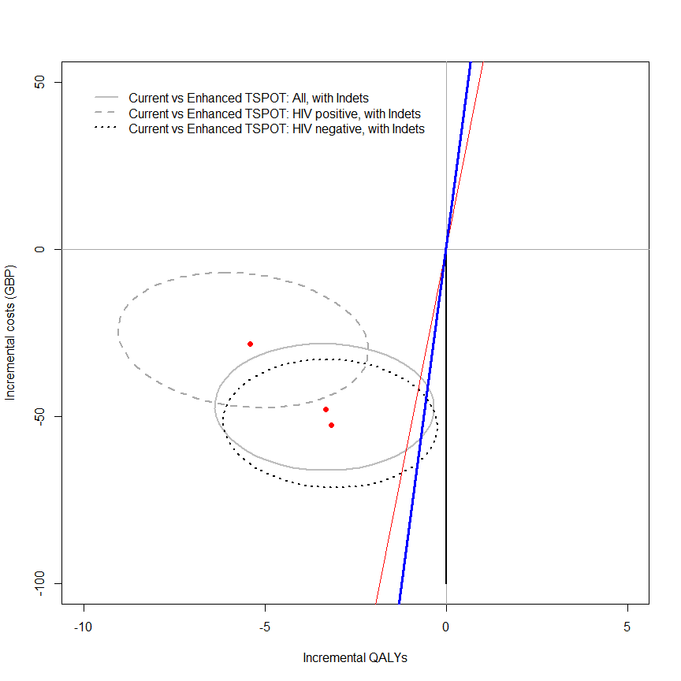

# Basecase cost-effectiveness comparison
Nathan Green  
4 February 2016  

<!-- README.md is generated from README.Rmd. Please edit that file -->


```r
# source("../../../analysis scripts/IDEA/alt-YAML_Binomial_dectrees/indiv-dectree-sampling.R")
```


```r
library(IDEAdectree)
library(BCEA)
```

```
## Warning: package 'BCEA' was built under R version 3.2.3
```

```r
library(ggplot2)
```

```
## Warning: package 'ggplot2' was built under R version 3.2.3
```

```r
# load("C:/Users/ngreen1/Dropbox/TB/IDEA/R/packages/IDEAdectree/data/TBdata_clinical_cleaned.RData")
load("../data/TBdata_clinical_cleaned.RData")
load("../data/COSTdistns_allerror.RData")
load("../data/senspec_env.RData")
load("../data/drug_dose-cost.RData")

## sensitivities and specificities from IDEA lab data
attach(senspec.env)

dat <- list()

yearindays <- 365
WTP <- c(20000, 30000)/yearindays
```


```r
dat1 <- IDEAdectree.simple(data=data, name.ruleout = "TSPOT",
                           SPEC = TSPOT.noIndet.spec.mean, SENS = TSPOT.noIndet.sens.mean, 
                           SPECvar = TSPOT.noIndet.spec.var, SENSvar = TSPOT.noIndet.sens.var)
```

```
## Loading required package: assertive
```

```
## Warning: package 'assertive' was built under R version 3.2.3
```

```r
dat2 <- IDEAdectree.simple(data=data, name.ruleout = "TSPOT",
                           SPEC = TSPOT.HIV.noIndet.spec.mean, SENS = TSPOT.HIV.noIndet.sens.mean, 
                           SPECvar = TSPOT.HIV.noIndet.spec.var, SENSvar = TSPOT.HIV.noIndet.sens.var)
dat3 <- IDEAdectree.simple(data=data, name.ruleout = "TSPOT",
                           SPEC = TSPOT.HIVneg.noIndet.spec.mean, SENS = TSPOT.HIVneg.noIndet.sens.mean, 
                           SPECvar = TSPOT.HIVneg.noIndet.spec.var, SENSvar = TSPOT.HIVneg.noIndet.sens.var)

dat$e <- cbind(dat1$e, dat2$e[,2], dat3$e[,2])
dat$c <- cbind(dat1$c, dat2$c[,2], dat3$c[,2])

intlabels <- c("Current",
               "Enhanced TSPOT: All, no Indets", "Enhanced TSPOT: HIV positive, no Indets", "Enhanced TSPOT: HIV negative, no Indets")

# m <- bcea(e=dat$e, c=-dat$c, ref=1, interventions = intlabels)
# contour2(m, wtp=WTP, graph = "ggplot2", ICER.size=2, pos=c(0.1,0.9))+#, xlim=c(-5,5), ylim=c(-200,200)) +
#   ggtitle("") #+ geom_abline(intercept = 0, slope = WTP)

my.plot.bcea(dat1, dat2, dat3, wtp=WTP, intlabels = intlabels, wtpNEG = "Y")
```

```
## Loading required package: MASS
```

```
## Warning: package 'MASS' was built under R version 3.2.2
```

```
## Loading required package: car
```

```
## Warning: package 'car' was built under R version 3.2.3
```


```
## [[1]]
## NULL
## 
## [[2]]
## NULL
```

```r
my.plot.bcea(dat1, dat2, dat3, wtp=WTP, intlabels = intlabels, contour=TRUE, wtpNEG = "Y")
```


```
## [[1]]
## NULL
## 
## [[2]]
## NULL
```

```r
my.plot.bcea(dat1, dat2, dat3, wtp=WTP, intlabels = intlabels, contour=TRUE, LEVELS=0.5, wtpNEG = "Y")
```


```
## [[1]]
## NULL
## 
## [[2]]
## NULL
```

```r
my.plot.ceac(dat1, dat2, dat3, intlabels = intlabels)
```


```r
## in years (not days)
# m <- bcea(e=dat$e/365, c=-dat$c, ref=1, interventions = intlabels)
# contour2(m, wtp=20000, graph = "ggplot2", ICER.size=2, pos=c(0.1,0.9))
# 
# ceac.plot(m)
```


```r
dat1 <- IDEAdectree.simple(data=data, name.ruleout = "TSPOT",
                           SPEC = TSPOT.Indet.spec.mean, SENS = TSPOT.Indet.sens.mean, 
                           SPECvar = TSPOT.Indet.spec.var, SENSvar = TSPOT.Indet.sens.var)
dat2 <- IDEAdectree.simple(data=data, name.ruleout = "TSPOT",
                           SPEC = TSPOT.HIV.Indet.spec.mean, SENS = TSPOT.HIV.Indet.sens.mean, 
                           SPECvar = TSPOT.HIV.Indet.spec.var, SENSvar = TSPOT.HIV.Indet.sens.var)
dat3 <- IDEAdectree.simple(data=data, name.ruleout = "TSPOT",
                           SPEC = TSPOT.HIVneg.Indet.spec.mean, SENS = TSPOT.HIVneg.Indet.sens.mean, 
                           SPECvar = TSPOT.HIVneg.Indet.spec.var, SENSvar = TSPOT.HIVneg.Indet.sens.var)

dat$e <- cbind(dat1$e, dat2$e[,2], dat3$e[,2])
dat$c <- cbind(dat1$c, dat2$c[,2], dat3$c[,2])

intlabels <- c("Current", "Enhanced TSPOT: All, with Indets", "Enhanced TSPOT: HIV positive, with Indets", "Enhanced TSPOT: HIV negative, with Indets")

# m <- bcea(e=dat$e, c=-dat$c, ref=1, interventions = intlabels)
# contour2(m, wtp=WTP, graph = "ggplot2", ICER.size=2, pos=c(0.1,0.9))+#, xlim=c(-5,5), ylim=c(-200,200)) +
#   ggtitle("") #+ geom_abline(intercept = 0, slope = WTP)

my.plot.bcea(dat1, dat2, dat3, wtp=WTP, intlabels = intlabels, wtpNEG = "Y")
```


```
## [[1]]
## NULL
## 
## [[2]]
## NULL
```

```r
my.plot.bcea(dat1, dat2, dat3, wtp=WTP, intlabels = intlabels, contour=TRUE, wtpNEG = "Y")
```


```
## [[1]]
## NULL
## 
## [[2]]
## NULL
```

```r
my.plot.bcea(dat1, dat2, dat3, wtp=WTP, intlabels = intlabels, contour=TRUE, LEVELS=0.5, wtpNEG = "Y")
```


```
## [[1]]
## NULL
## 
## [[2]]
## NULL
```

```r
my.plot.ceac(dat1, dat2, dat3, intlabels = intlabels)
```


```r
## in years (not days)
# m <- bcea(e=dat$e/365, c=-dat$c, ref=1, interventions = intlabels)
# contour2(m, wtp=20000, graph = "ggplot2", ICER.size=2, pos=c(0.1,0.9))
# 
# ceac.plot(m)
```


```r
dat1 <- IDEAdectree.simple(data=data, name.ruleout = "QFN",
                           SPEC = QFN.noIndet.spec.mean, SENS = QFN.noIndet.sens.mean, 
                           SPECvar = QFN.noIndet.spec.var, SENSvar = QFN.noIndet.sens.var)
dat2 <- IDEAdectree.simple(data=data, name.ruleout = "QFN",
                           SPEC = QFN.HIV.noIndet.spec.mean, SENS = QFN.HIV.noIndet.sens.mean, 
                           SPECvar = QFN.HIV.noIndet.spec.var, SENSvar = QFN.HIV.noIndet.sens.var)
dat3 <- IDEAdectree.simple(data=data, name.ruleout = "QFN",
                           SPEC = QFN.HIVneg.noIndet.spec.mean, SENS = QFN.HIVneg.noIndet.sens.mean, 
                           SPECvar = QFN.HIVneg.noIndet.spec.var, SENSvar = QFN.HIVneg.noIndet.sens.var)

dat$e <- cbind(dat1$e, dat2$e[,2], dat3$e[,2])
dat$c <- cbind(dat1$c, dat2$c[,2], dat3$c[,2])

intlabels <- c("Current",
               "Enhanced QFN: All, no Indets", "Enhanced QFN: HIV positive, no Indets", "Enhanced QFN: HIV negative, no Indets")

# m <- bcea(e=dat$e, c=-dat$c, ref=1, interventions = intlabels)
# contour2(m, wtp=WTP, graph = "ggplot2", ICER.size=2, pos=c(0.1,0.9))+#, xlim=c(-5,5), ylim=c(-200,200)) +
#   ggtitle("") #+ geom_abline(intercept = 0, slope = WTP)

my.plot.bcea(dat1, dat2, dat3, wtp=WTP, intlabels = intlabels, wtpNEG = "Y")
```


```
## [[1]]
## NULL
## 
## [[2]]
## NULL
```

```r
my.plot.bcea(dat1, dat2, dat3, wtp=WTP, intlabels = intlabels, contour=TRUE, wtpNEG = "Y")
```


```
## [[1]]
## NULL
## 
## [[2]]
## NULL
```

```r
my.plot.bcea(dat1, dat2, dat3, wtp=WTP, intlabels = intlabels, contour=TRUE, LEVELS=0.5, wtpNEG = "Y")
```


```
## [[1]]
## NULL
## 
## [[2]]
## NULL
```

```r
my.plot.ceac(dat1, dat2, dat3, intlabels = intlabels)
```


```r
## in years (not days)
# m <- bcea(e=dat$e/365, c=-dat$c, ref=1, interventions = intlabels)
# contour2(m, wtp=20000, graph = "ggplot2", ICER.size=2, pos=c(0.1,0.9))
# 
# ceac.plot(m)
```


```r
dat1 <- IDEAdectree.simple(data=data, name.ruleout = "QFN",
                           SPEC = QFN.Indet.spec.mean, SENS = QFN.Indet.sens.mean, 
                           SPECvar = QFN.Indet.spec.var, SENSvar = QFN.Indet.sens.var)
dat2 <- IDEAdectree.simple(data=data, name.ruleout = "QFN",
                           SPEC = QFN.HIV.Indet.spec.mean, SENS = QFN.HIV.Indet.sens.mean, 
                           SPECvar = QFN.HIV.Indet.spec.var, SENSvar = QFN.HIV.Indet.sens.var)
dat3 <- IDEAdectree.simple(data=data, name.ruleout = "QFN",
                           SPEC = QFN.HIVneg.Indet.spec.mean, SENS = QFN.HIVneg.Indet.sens.mean, 
                           SPECvar = QFN.HIVneg.Indet.spec.var, SENSvar = QFN.HIVneg.Indet.sens.var)

dat$e <- cbind(dat1$e, dat2$e[,2], dat3$e[,2])
dat$c <- cbind(dat1$c, dat2$c[,2], dat3$c[,2])

intlabels <- c("Current", "Enhanced QFN: All, with Indets", "Enhanced QFN: HIV positive, with Indets", "Enhanced QFN: HIV negative, with Indets")

# m <- bcea(e=dat$e, c=-dat$c, ref=1, interventions = intlabels)
# contour2(m, wtp=WTP, graph = "ggplot2", ICER.size=2, pos=c(0.1,0.9))+#, xlim=c(-5,5), ylim=c(-200,200)) +
#   ggtitle("") #+ geom_abline(intercept = 0, slope = WTP)

my.plot.bcea(dat1, dat2, dat3, wtp=WTP, intlabels = intlabels, wtpNEG = "Y")
```


```
## [[1]]
## NULL
## 
## [[2]]
## NULL
```

```r
my.plot.bcea(dat1, dat2, dat3, wtp=WTP, intlabels = intlabels, contour=TRUE, wtpNEG = "Y")
```


```
## [[1]]
## NULL
## 
## [[2]]
## NULL
```

```r
my.plot.bcea(dat1, dat2, dat3, wtp=WTP, intlabels = intlabels, contour=TRUE, LEVELS=0.5, wtpNEG = "Y")
```



```
## [[1]]
## NULL
## 
## [[2]]
## NULL
```

```r
my.plot.ceac(dat1, dat2, dat3, intlabels = intlabels)
```


```r
## in years (not days)
# m <- bcea(e=dat$e/365, c=-dat$c, ref=1, interventions = intlabels)
# contour2(m, wtp=20000, graph = "ggplot2", ICER.size=2, pos=c(0.1,0.9))
# 
# ceac.plot(m)
```


```r
detach(senspec.env)
```


